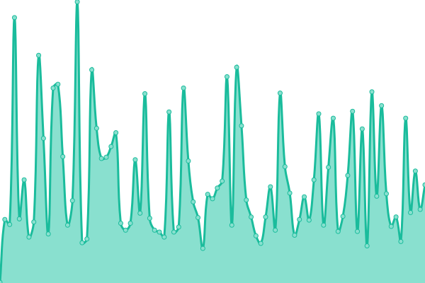
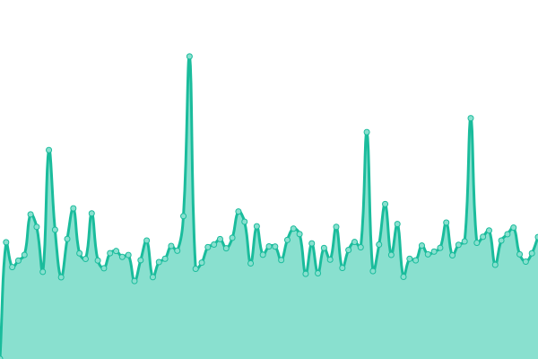
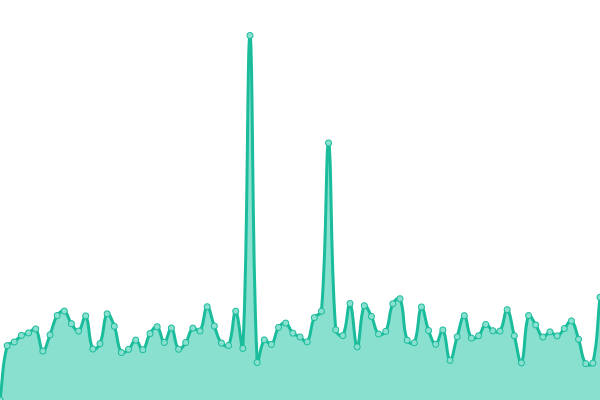

# [📈 Live Status](https://status.rongyi.io): <!--live status--> **🟩 All systems operational**

<!--start: status pages-->
<!-- This summary is generated by Upptime (https://github.com/upptime/upptime) -->
<!-- Do not edit this manually, your changes will be overwritten -->
<!-- prettier-ignore -->
| URL | Status | History | Response Time | Uptime |
| --- | ------ | ------- | ------------- | ------ |
|  [[Web] Homepage](https://rongyi.xyz) | 🟩 Up | [web-homepage.yml](https://github.com/LER0ever/Status/commits/HEAD/history/web-homepage.yml) | 

 486ms
     
 | 

<a href="https://status.rongyi.io/history/web-homepage">100.00%</a>
    

|  [[Web] Academic Site](https://rongyi.ai) | 🟩 Up | [web-academic-site.yml](https://github.com/LER0ever/Status/commits/HEAD/history/web-academic-site.yml) | 

 313ms
     
 | 

<a href="https://status.rongyi.io/history/web-academic-site">100.00%</a>
    

|  [[Web] Blog](https://rongyi.blog) | 🟩 Up | [web-blog.yml](https://github.com/LER0ever/Status/commits/HEAD/history/web-blog.yml) | 

 388ms
     
 | 

<a href="https://status.rongyi.io/history/web-blog">100.00%</a>
    

|  [[Web] Page](https://rongyi.page) | 🟩 Up | [web-page.yml](https://github.com/LER0ever/Status/commits/HEAD/history/web-page.yml) | 

 333ms
     
 | 

<a href="https://status.rongyi.io/history/web-page">100.00%</a>
    

|  [[Web] Status Site itself](https://status.rongyi.io) | 🟩 Up | [web-status-site-itself.yml](https://github.com/LER0ever/Status/commits/HEAD/history/web-status-site-itself.yml) | 

 130ms
     
 | 

<a href="https://status.rongyi.io/history/web-status-site-itself">100.00%</a>
    

|  [[Dev] Lab @ rongyi.io](https://lab.rongyi.io/explore/snippets) | 🟩 Up | [dev-lab-rongyi-io.yml](https://github.com/LER0ever/Status/commits/HEAD/history/dev-lab-rongyi-io.yml) | 

 861ms
     
 | 

<a href="https://status.rongyi.io/history/dev-lab-rongyi-io">100.00%</a>
    

|  [[Dev] CR @ rongyi.io](https://cr.rongyi.io) | 🟩 Up | [dev-cr-rongyi-io.yml](https://github.com/LER0ever/Status/commits/HEAD/history/dev-cr-rongyi-io.yml) | 

 481ms
     
 | 

<a href="https://status.rongyi.io/history/dev-cr-rongyi-io">100.00%</a>
    

|  [[Dev] SourceGraph @ rongyi.io](https://src.rongyi.io) | 🟩 Up | [dev-source-graph-rongyi-io.yml](https://github.com/LER0ever/Status/commits/HEAD/history/dev-source-graph-rongyi-io.yml) | 

 809ms
     
 | 

<a href="https://status.rongyi.io/history/dev-source-graph-rongyi-io">100.00%</a>
    

|  [[CDN] AWS S3 (cdn.rongyi.io)](https://cdn.rongyi.io/index.html) | 🟩 Up | [cdn-aws-s3-cdn-rongyi-io.yml](https://github.com/LER0ever/Status/commits/HEAD/history/cdn-aws-s3-cdn-rongyi-io.yml) | 

 178ms
     
 | 

<a href="https://status.rongyi.io/history/cdn-aws-s3-cdn-rongyi-io">100.00%</a>
    

|  [[Email] G Suite (@rongyi.io) inbound](aspmx.l.google.com) | 🟩 Up | [email-g-suite-rongyi-io-inbound.yml](https://github.com/LER0ever/Status/commits/HEAD/history/email-g-suite-rongyi-io-inbound.yml) | 

 15ms
     
 | 

<a href="https://status.rongyi.io/history/email-g-suite-rongyi-io-inbound">100.00%</a>
    

|  [[Email] G Suite (@rongyi.io) outbound](smtp.gmail.com) | 🟩 Up | [email-g-suite-rongyi-io-outbound.yml](https://github.com/LER0ever/Status/commits/HEAD/history/email-g-suite-rongyi-io-outbound.yml) | 

 14ms
     
 | 

<a href="https://status.rongyi.io/history/email-g-suite-rongyi-io-outbound">100.00%</a>
    

|  [[Email] Office 365 (@rongyi.xyz) inbound](ry-sb.mail.protection.outlook.com) | 🟩 Up | [email-office-365-rongyi-xyz-inbound.yml](https://github.com/LER0ever/Status/commits/HEAD/history/email-office-365-rongyi-xyz-inbound.yml) | 

 94ms
     
 | 

<a href="https://status.rongyi.io/history/email-office-365-rongyi-xyz-inbound">100.00%</a>
    

|  [[Email] Office 365 (@rongyi.xyz) outbound](smtp.office365.com) | 🟩 Up | [email-office-365-rongyi-xyz-outbound.yml](https://github.com/LER0ever/Status/commits/HEAD/history/email-office-365-rongyi-xyz-outbound.yml) | 

 7ms
     
 | 

<a href="https://status.rongyi.io/history/email-office-365-rongyi-xyz-outbound">100.00%</a>
    

|  [[Email] Relay / Bounce (r.rongyi.xyz)](mx1.simplelogin.co) | 🟩 Up | [email-relay-bounce-r-rongyi-xyz.yml](https://github.com/LER0ever/Status/commits/HEAD/history/email-relay-bounce-r-rongyi-xyz.yml) | 

 152ms
     
 | 

<a href="https://status.rongyi.io/history/email-relay-bounce-r-rongyi-xyz">100.00%</a>
    

<!--end: status pages-->

[**Visit our status website →**](https://status.rongyi.io)

## 📄 License

- Powered by: [Upptime](https://github.com/upptime/upptime)
- Code: [MIT](./LICENSE) © [Yi Rong](https://rongyi.ai)
- Data in the `./history` directory: [Open Database License](https://opendatacommons.org/licenses/odbl/1-0/)
